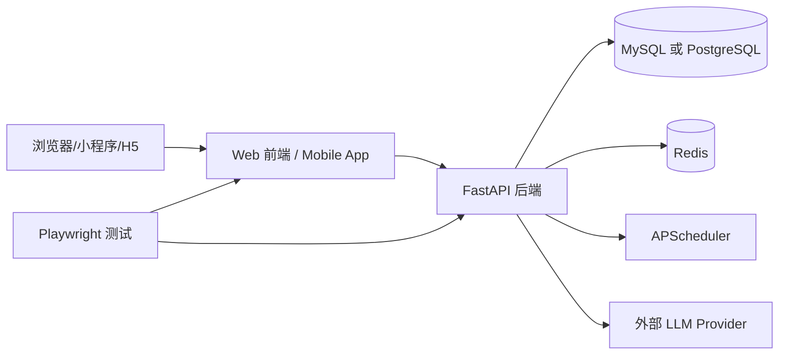

# 项目总览

## 1. 项目定位

`RuoYi-Vue3-FastAPI` 是一套典型的管理后台型单仓项目，核心目标是提供一整套可二次开发的平台基础能力，包括：

- 用户、角色、菜单、部门、岗位等基础权限体系
- 字典、参数、公告、日志、在线用户等系统能力
- 定时任务、缓存监控、服务监控等运维能力
- 代码生成能力
- AI 模型管理和 AI 对话能力
- Web 管理端与移动端双前端接入

## 2. 仓库总体结构

```text
/workspace
├── ruoyi-fastapi-backend   # FastAPI 后端
├── ruoyi-fastapi-frontend  # Vue3 Web 管理端
├── ruoyi-fastapi-app       # uni-app 移动端
├── ruoyi-fastapi-test      # Playwright E2E 测试
├── docker-compose.my.yml   # MySQL 部署编排
├── docker-compose.pg.yml   # PostgreSQL 部署编排
└── README.md               # 根级说明
```

## 3. 技术栈矩阵

| 层次 | 子项目 | 主要技术 |
| --- | --- | --- |
| 后端 | `ruoyi-fastapi-backend` | FastAPI、SQLAlchemy Async、Redis、APScheduler、PyJWT、Pydantic、Loguru |
| Web 前端 | `ruoyi-fastapi-frontend` | Vue 3、Vite、Element Plus、Pinia、Vue Router、Axios |
| 移动端 | `ruoyi-fastapi-app` | uni-app、Vue 3、Vite、TypeScript、Pinia、TailwindCSS |
| 测试 | `ruoyi-fastapi-test` | pytest、pytest-playwright、Playwright |
| 容器部署 | 根目录 | Docker Compose、Nginx、MySQL / PostgreSQL、Redis |

## 4. 运行时拓扑



## 5. 四个子项目的职责边界

### 5.1 后端

后端是整套系统的能力中心，负责：

- 认证与授权
- 动态菜单与按钮权限数据下发
- 业务实体 CRUD
- 数据缓存与系统参数初始化
- 定时任务调度与执行日志记录
- 代码生成与模板渲染
- AI 模型与流式对话能力
- 传输层请求解密与响应加密

### 5.2 Web 管理端

Web 端是主要的管理后台交互入口，特点是：

- 使用后端返回的菜单树动态生成前端路由
- 采用 Pinia 管理用户、权限、标签页、设置等状态
- 用统一 Axios 封装处理 token、重复提交、传输加解密和错误提示
- 页面结构与后台模块高度一一对应

### 5.3 移动端

移动端强调轻量使用场景，特点是：

- 页面数量相对少，偏用户中心与工作台场景
- 使用固定页面清单，不采用 Web 端那种菜单驱动动态路由模式
- 同样复用后端的 token、登录态、传输加解密能力
- 支持 H5、微信小程序、App 等多个 uni-app 目标平台

### 5.4 测试套件

测试项目承担验收与回归验证职责：

- 验证登录流程
- 验证受保护页面跳转
- 验证系统管理、监控、代码生成等核心页面是否可访问
- 提供基于 Docker 的测试环境启动方式

## 6. 关键入口文件

| 入口 | 作用 |
| --- | --- |
| `ruoyi-fastapi-backend/app.py` | Uvicorn 进程入口 |
| `ruoyi-fastapi-backend/server.py` | FastAPI 应用工厂、生命周期管理、路由和中间件装配 |
| `ruoyi-fastapi-frontend/src/main.js` | Web 应用入口，注册路由、状态、插件、全局组件 |
| `ruoyi-fastapi-app/src/main.ts` | uni-app 入口，注册 Pinia、插件和权限拦截 |
| `ruoyi-fastapi-test/README.md` | 测试启动与执行说明 |

## 7. 系统最重要的几条主链路

### 7.1 启动链路

- 后端启动时创建 FastAPI 实例
- 初始化 Redis 连接
- 初始化数据库表结构
- 将系统字典与系统参数缓存到 Redis
- 初始化调度器和日志聚合后台任务
- 注册中间件、异常处理和所有 controller 路由

### 7.2 认证链路

- 前端调用 `/login`
- 后端校验验证码、密码、锁定状态、黑名单 IP
- 后端生成 JWT 并写入 Redis
- 前端缓存 token
- 后续请求统一在请求头中注入 `Authorization`

### 7.3 动态菜单链路

- Web 前端登录后请求 `/getInfo` 和 `/getRouters`
- 后端根据用户角色与菜单表生成路由树
- 前端将路由树映射为 `views/**/*.vue` 组件
- 最终驱动侧边栏、顶栏、面包屑与权限访问控制

### 7.4 统一请求处理链路

- 前端请求层负责 token 注入、重复提交保护、传输加密
- 后端中间件链负责上下文、CORS、Gzip、Trace、演示模式、传输加解密
- 业务异常由统一异常处理层转换为标准 JSON 响应

## 8. 目录层级理解建议

第一次阅读代码时，建议按以下顺序进入：

1. 根目录 `README.md` 了解产品边界
2. `ruoyi-fastapi-backend/server.py` 了解后端应用装配
3. `ruoyi-fastapi-backend/common/router.py` 了解路由自动注册机制
4. `ruoyi-fastapi-frontend/src/main.js` 和 `src/permission.js` 了解 Web 入口和权限流
5. `ruoyi-fastapi-app/src/main.ts` 和 `src/permission.js` 了解移动端入口
6. `05-业务模块清单.md` 对照具体 controller / page / api 文件定位业务实现
