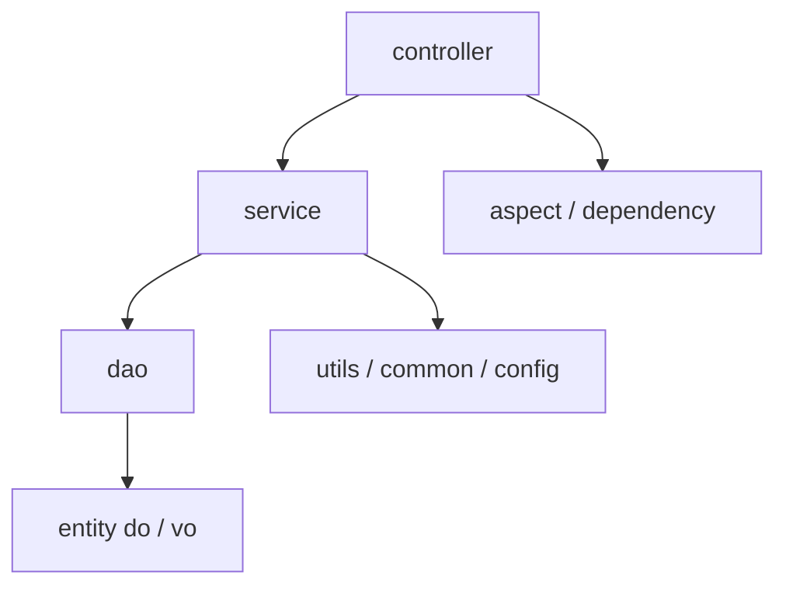

# 后端架构

## 1. 后端目录结构

```text
ruoyi-fastapi-backend
├── app.py
├── server.py
├── alembic/             # Alembic 数据库迁移脚本目录
├── alembic.ini          # Alembic 配置
├── assets/              # 后端运行期资源（图标、模板等）
├── config/              # 配置、数据库、Redis、调度器初始化
├── common/              # 公共常量、上下文、注解、切面、路由扩展
├── docs/                # 后端补充文档
├── exceptions/          # 异常类型与全局异常处理
├── middlewares/         # 全局中间件
├── module_admin/        # 系统管理与监控主模块
├── module_ai/           # AI 模型与对话模块
├── module_generator/    # 代码生成模块
├── module_task/         # 定时任务函数与调度样例
├── sub_applications/    # 静态资源等子应用挂载
├── utils/               # 各类通用工具
├── sql/                 # 初始化 SQL
└── tests/               # 后端局部测试
```

> 注意：项目同时存在 `alembic/` 与 `lifespan` 中的 `init_create_table()`（基于 `Base.metadata.create_all`）。
> 启动初始化走的是 `create_all`，`alembic` 是预留的正式迁移通道，二次开发时需要明确选择其中一条进行表结构演进，不要同时使用两套机制。

## 2. 启动与装配

### 2.1 入口文件

- `app.py` 负责以 `uvicorn.run()` 启动应用。
- `server.py` 中的 `create_app()` 是真正的应用工厂。

### 2.2 `create_app()` 做的事情

`server.py` 中的 `create_app()` 按以下顺序装配应用：

1. 配置 Swagger / ReDoc 静态资源与文档路由
2. 创建 `FastAPI` 实例
3. 挂载子应用
4. 注册全局中间件
5. 注册全局异常处理
6. 自动扫描并注册所有 controller 路由

这意味着后端不是手工在单个文件中 `include_router()`，而是采用自动发现机制完成路由接入。

### 2.3 生命周期 `lifespan`

`lifespan` 是后端运行链路的核心：

- 创建 Redis 连接池
- 竞争应用级启动锁，避免多 worker 场景重复初始化
- 校验传输层加密运行配置
- 初始化数据库表结构
- 检查 Redis 连接
- 初始化系统字典缓存
- 初始化系统参数缓存
- 启动调度器
- 启动日志聚合后台任务
- 在关闭时停止后台任务、关闭 Redis、关闭调度器、释放数据库连接池

## 3. 配置体系

`config/env.py` 使用 `pydantic-settings` 统一读取环境变量，并根据 `--env` 参数或 `APP_ENV` 选择 `.env.dev` / `.env.prod` 等配置文件。

### 3.1 主要配置模型

| 配置类 | 作用 |
| --- | --- |
| `AppSettings` | 应用名、端口、根路径、worker 数、demo 模式、文档开关 |
| `JwtSettings` | JWT 密钥、算法、有效期 |
| `DataBaseSettings` | 数据库类型、连接参数、连接池配置 |
| `RedisSettings` | Redis 连接参数 |
| `LogSettings` | 日志脱敏、日志流、Loguru 输出等 |
| `TransportCryptoSettings` | 传输层加解密启停、算法、公钥 TTL、排除路径 |
| `GenSettings` | 代码生成默认配置 |
| `UploadSettings` | 上传、下载目录与白名单后缀 |
| `CachePathConfig` | 各类本地缓存目录的路径常量 |
| `GetConfig` | 上述配置模型的聚合入口，运行期通过 `AppConfig` / `JwtConfig` 等单例对外暴露 |

### 3.2 配置特点

- 运行环境切换通过命令行参数 `--env=dev|prod|...` 完成。
- 同时支持 MySQL 与 PostgreSQL。
- 传输加解密是项目的重要基础设施能力，不是临时插件。
- 代码生成和上传目录会在初始化阶段自动创建。

## 4. 分层设计

后端整体采用典型的四层结构：



### 4.1 controller 层

职责：

- 定义 API 路由
- 声明请求体、响应模型、依赖注入
- 组合注解，例如日志、缓存、限流、权限
- 调用 service 完成业务

### 4.2 service 层

职责：

- 编排业务流程
- 处理跨 DAO 逻辑
- 做缓存、权限、调度、模板渲染、AI 调用等复杂业务
- 在必要时管理事务提交 / 回滚

### 4.3 dao 层

职责：

- 直接与数据库交互
- 组织查询、更新、删除、分页
- 为 service 提供更稳定的读写接口

### 4.4 entity 层

职责：

- `do`：数据库实体对象
- `vo`：接口输入输出模型、业务承载模型

## 5. 路由自动注册机制

`common/router.py` 是整个后端模块化组织的关键。

### 5.1 `APIRouterPro`

`APIRouterPro` 在 FastAPI 原生 `APIRouter` 基础上补充了：

- `order_num`：路由注册顺序控制
- `auto_register`：是否参与自动注册

### 5.2 `RouterRegister`

`RouterRegister` 的职责：

- 扫描项目根目录下 `*/controller/[!_]*.py`
- 动态导入 controller 模块
- 搜索模块中的 `APIRouterPro` / `APIRouter` 实例
- 对 `APIRouterPro` 按 `order_num` 排序
- 统一 `include_router()` 到应用实例

### 5.3 这一设计带来的好处

- 模块新增 controller 时，无需回到中心文件手工注册
- 不同业务模块可以按目录自然扩展
- 路由注册顺序可控
- 适合中大型后台项目的模块化迭代

## 6. 中间件体系

`middlewares/handle.py` 统一装配中间件，顺序如下：

1. 上下文清理中间件
2. CORS 中间件
3. Gzip 压缩中间件
4. 接口响应头追加中间件
5. Trace 中间件
6. 演示模式中间件（按配置启用）
7. 传输层请求解密 / 响应加密中间件

### 6.1 中间件职责说明

| 装配函数 | 作用 |
| --- | --- |
| `add_context_cleanup_middleware` | 清理请求级上下文，避免脏状态泄漏 |
| `add_cors_middleware` | 控制跨域访问 |
| `add_gzip_middleware` | 压缩响应 |
| `add_api_response_header_middleware` | 增补统一响应头 |
| `add_trace_middleware` | 记录请求 Trace 上下文 |
| `add_demo_mode_middleware` | 演示环境限制危险操作（仅在 `APP_DEMO_MODE=true` 时启用） |
| `add_transport_crypto_middleware` | 处理前后端传输层加解密 |

## 7. 异常处理体系

`exceptions/handle.py` 统一把异常映射为标准响应。

### 7.1 项目自定义异常（定义在 `exceptions/exception.py`）

- `AuthException`：认证失败，返回未授权响应（401）
- `LoginException`：登录失败，返回业务失败响应
- `PermissionException`：权限不足，返回禁止访问响应（403）
- `ServiceException`：服务异常，返回错误响应
- `ServiceWarning`：业务警告，返回失败响应
- `ModelValidatorException`：模型自定义校验失败异常

### 7.2 接管的外部异常

- `FieldValidationError`：来自第三方 `pydantic_validation_decorator`，用于字段级校验
- `HTTPException`：FastAPI / Starlette 的 HTTP 级异常
- `Exception`：兜底异常处理

统一异常层的重要价值是：前端只需要围绕标准 `code` / `msg` 结构处理错误。

## 8. 依赖注入与切面

### 8.1 常见依赖

| 依赖 / 切面 | 作用 |
| --- | --- |
| `DBSessionDependency()` | 注入异步数据库会话 |
| `CurrentUserDependency()` | 从 token 解析当前用户 |
| `ApiCache` / `ApiCacheEvict` | 接口级缓存 / 缓存失效 |
| `ApiRateLimit` | 接口限流 |
| `Log` | 操作日志注解 |
| `pre_auth` | 鉴权前置处理 |
| `data_scope` | 数据权限范围处理 |

### 8.2 `LoginService.get_current_user()` 的作用

这是最关键的鉴权函数之一，它负责：

- 解码 JWT
- 校验 Redis 中缓存的有效 token
- 查询当前用户、角色、岗位、菜单
- 计算 `roles` 与 `permissions`
- 判断初始密码和密码过期状态
- 把当前用户写入请求上下文

## 9. 核心业务模块

### 9.1 `module_admin`

这是最大、最核心的后端模块，承担系统管理与监控功能。

目录结构遵循：

```text
module_admin
├── controller
├── dao
├── entity/do
├── entity/vo
└── service
```

主要能力包括：

- 登录、退出、获取用户信息、获取动态路由
- 用户、角色、菜单、部门、岗位管理
- 字典、参数、公告管理
- 操作日志、登录日志
- 在线用户、缓存监控、服务监控
- 定时任务与任务日志
- 传输层加解密运行策略管理

### 9.2 `module_ai`

AI 模块提供两类能力：

- 模型管理
- 对话管理

`AiChatService` 是核心服务，负责：

- 读取模型配置与用户配置
- 解密模型 API Key
- 构建 Agno `Agent`
- 处理是否带历史、是否开启 reasoning
- 支持图片输入
- 将模型输出转换为流式 SSE 文本片段
- 查询 / 删除对话 session
- 取消进行中的 run

### 9.3 `module_generator`

代码生成模块是本项目的平台型特色能力，`GenTableService` 负责：

- 读取数据库表结构
- 导入表和列元数据
- 同步数据库与生成配置
- 预览模板渲染结果
- 将模板渲染到磁盘
- 批量打包下载生成代码
- 校验建表 SQL 是否安全合法

### 9.4 `module_task`

该模块承载可被调度器动态调用的任务函数。调度目标通过字符串路径如 `module_task.scheduler_test.job` 存储，在运行时由调度器动态导入执行。

## 10. 关键服务与函数说明

### 10.1 `create_app()`

位置：`server.py`

职责：

- 创建 FastAPI 应用实例
- 配置 API 文档
- 挂载子应用、中间件、异常处理
- 自动注册所有业务路由

### 10.2 `lifespan()`

位置：`server.py`

职责：

- 执行启动 / 关闭阶段的资源管理
- 初始化 Redis、数据库、系统缓存、调度器与后台任务
- 负责应用级锁与日志门控

### 10.3 `LoginService.authenticate_user()`

职责：

- 校验 IP 黑名单
- 检查账号锁定状态
- 验证验证码
- 校验用户名密码
- 密码错误次数累计与账号锁定
- 返回用户与部门信息

### 10.4 `LoginService.get_current_user_routers()`

职责：

- 根据当前用户菜单生成前端路由树
- 将数据库菜单结构转换成 Web 端可直接消费的路由 JSON

### 10.5 `SchedulerUtil.init_system_scheduler()`

职责：

- 初始化分布式调度器
- 通过 Redis 锁决定当前 worker 是否为 leader
- 只允许 leader worker 正式启动 scheduler

### 10.6 `GenTableService.preview_code_services()`

职责：

- 按表配置准备模板上下文
- 渲染模板并返回预览内容
- 为前端的代码预览界面提供基础数据

### 10.7 `AiChatService.chat_services()`

职责：

- 根据模型和用户配置构造 Agent
- 发起流式对话
- 将返回内容组织为前端可消费的 SSE 风格消息片段

## 11. 调度器设计

`config/get_scheduler.py` 是后端中最复杂的基础设施之一。

### 11.1 设计目标

- 支持多 worker 运行
- 避免同一任务在多个 worker 重复执行
- 支持从数据库同步任务状态
- 支持非 leader worker 的同步执行兜底
- 支持任务变更广播和节流同步

### 11.2 核心实现点

- 使用 Redis 锁确定 leader worker
- APScheduler 同时使用 Memory / SQLAlchemy / Redis jobstore
- 通过 Pub/Sub 通道传播任务同步请求
- 通过更新时间缓存避免重复无效同步
- 支持锁丢失后的自动释放和重新竞争

## 12. 数据与缓存初始化

### 12.1 数据库

`config/get_db.py` 中：

- `get_db()` 提供每请求一个异步 Session
- `init_create_table()` 在启动时执行 `Base.metadata.create_all`
- `close_async_engine()` 在关闭时释放连接池

### 12.2 Redis

`config/get_redis.py` 中：

- `create_redis_pool()` 创建 Redis 连接
- `check_redis_connection()` 验证连通性
- `init_sys_dict()` 预热字典缓存
- `init_sys_config()` 预热系统参数缓存
- `close_redis_pool()` 关闭连接

## 13. 后端阅读建议

建议按以下顺序阅读后端代码：

1. `app.py`
2. `server.py`
3. `config/env.py`
4. `common/router.py`
5. `middlewares/handle.py`
6. `exceptions/handle.py`
7. `module_admin/controller/login_controller.py`
8. `module_admin/service/login_service.py`
9. `config/get_scheduler.py`
10. `module_generator/service/gen_service.py`
11. `module_ai/service/ai_chat_service.py`
