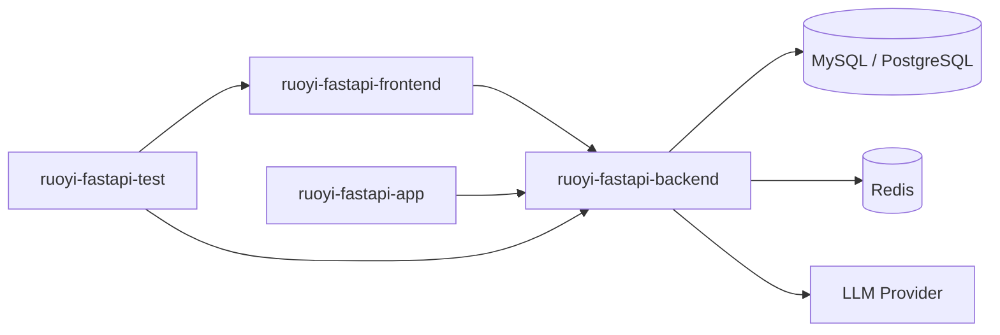
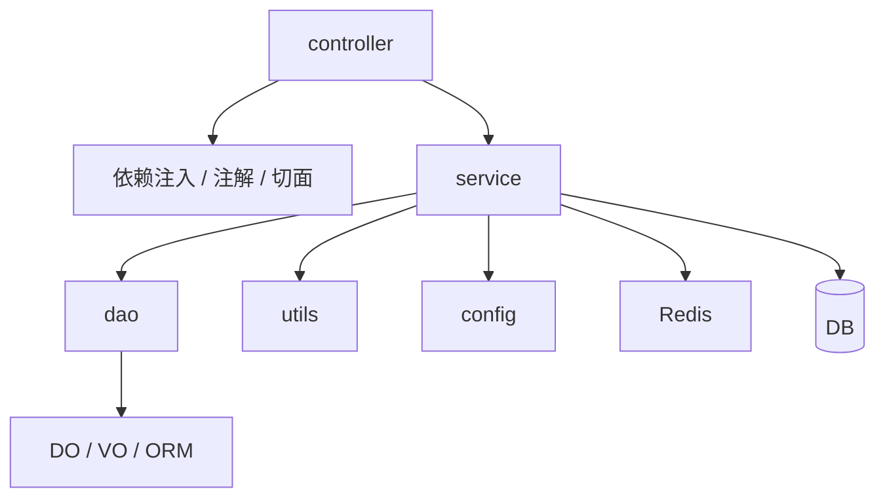
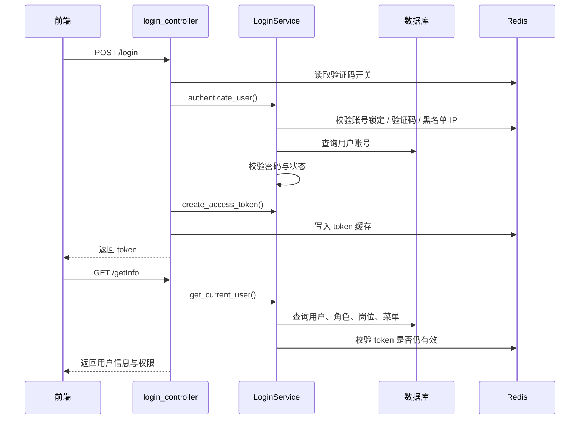
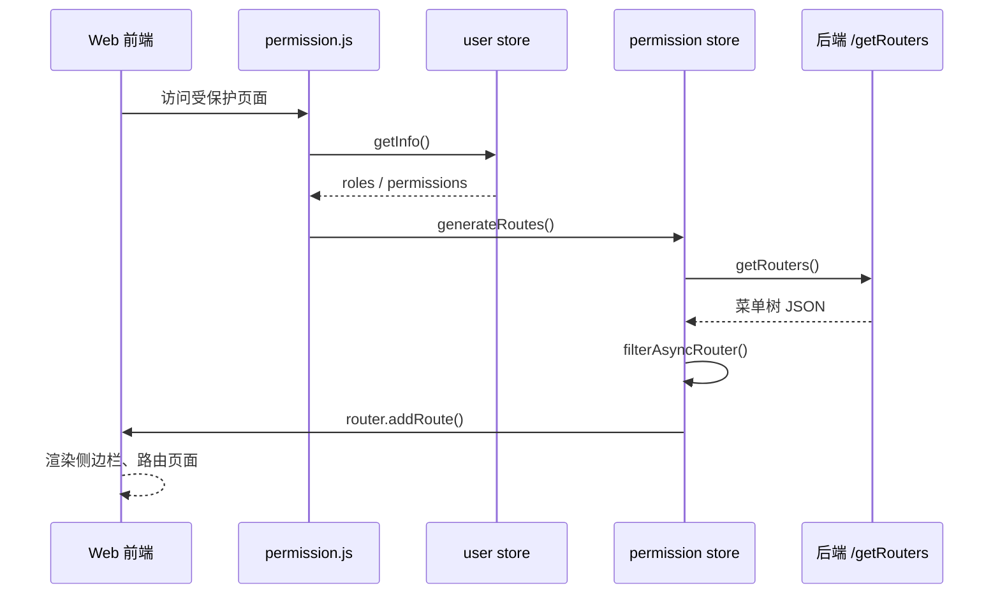
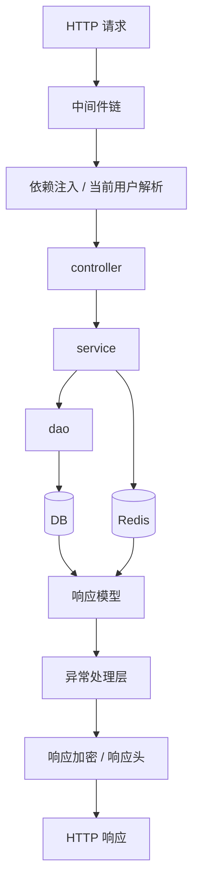
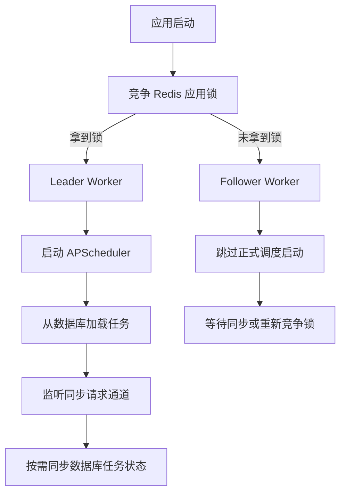
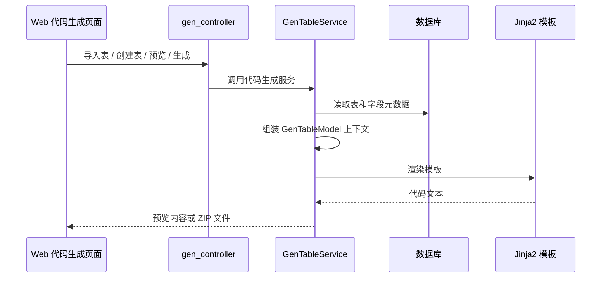
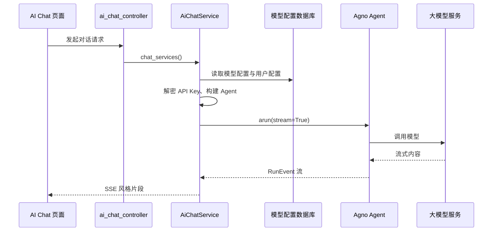

# 依赖关系与关键流程

## 1. 子项目依赖关系

## 2. 后端内部依赖关系

## 3. 登录与认证流程

## 4. Web 动态菜单流程

## 5. 后端请求处理流程

## 6. 传输层加解密流程

项目的前后端都内置了传输层加解密能力。

### 6.1 前端侧

- 请求发送前调用 `encryptTransportRequest()`
- 响应返回后调用 `decryptTransportResponse()`
- 发生异常时调用 `decryptTransportErrorResponse()`
- 遇到密钥失效时，清理本地密钥元数据并自动重试一次

### 6.2 后端侧

- 通过 `transport_crypto_middleware` 处理请求解密和响应加密
- 通过专门的 controller / service 提供公钥与前端策略配置
- 通过配置控制哪些路径启用、必需或排除加密

### 6.3 价值

- 降低敏感参数明文透传风险
- 为 Web 与 App 提供统一的安全通信策略

## 7. 调度器与多 worker 同步流程

### 7.1 关键点

- 只有 leader worker 正式持有 scheduler
- 任务状态持久化在数据库中
- 非 leader worker 可以请求同步
- 锁丢失后会自动释放资源并尝试重新竞争

## 8. 代码生成流程

### 8.1 代码生成的输入

- 数据库表结构
- 代码生成配置表
- 模板分类和 Web 类型配置

### 8.2 代码生成的输出

- Python controller / service / dao / do / vo
- Vue 页面
- JS API 文件
- SQL 文件

## 9. AI 对话流程

### 9.1 `AiChatService` 处理的关键问题

- 模型配置解析
- 用户个性化配置解析
- 历史消息轮次控制
- 推理模式开关
- 图片输入转本地文件路径
- 对话 session 的查询、删除与取消

## 10. 测试依赖关系

- 测试套件依赖 Web 和后端同时运行
- 默认通过浏览器访问前端页面，再由前端调用后端接口
- Docker 测试编排会同时启动数据库、Redis、后端、前端

## 11. 关键耦合点总结

### 11.1 Web 与后端的强耦合点

- `/getInfo`
- `/getRouters`
- 路由组件字符串与 `views` 目录结构映射规则
- 标准业务响应结构 `code / msg / data`
- 传输层加密协议

### 11.2 App 与后端的强耦合点

- 登录态 token 规则
- 标准响应结构
- 传输层加密协议
- 用户信息与字典接口

### 11.3 后端与基础设施的强耦合点

- Redis：token、系统参数、字典缓存、启动锁、调度同步
- 数据库：业务数据、调度任务、代码生成配置
- 外部 LLM：AI 模块能力来源

## 12. 理解项目的核心抓手

如果只能记住几个关键点，建议记住这 6 条：

1. 后端用 `create_app() + lifespan + auto_register_routers()` 组织系统。
2. Web 端最核心链路是 `getInfo() + getRouters() + generateRoutes()`。
3. App 端使用固定页面清单和统一跳转拦截。
4. Redis 不只是缓存，还承担 token、启动锁和调度同步职责。
5. 调度器是多 worker 场景下的 leader 模式实现。
6. 代码生成和 AI 对话是平台差异化能力，不是附属 demo。
